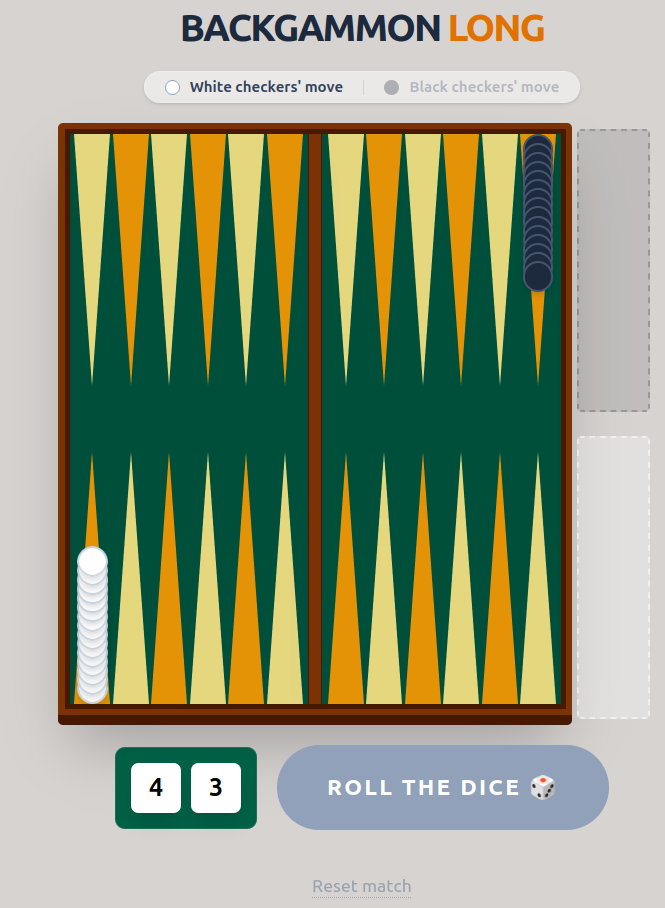
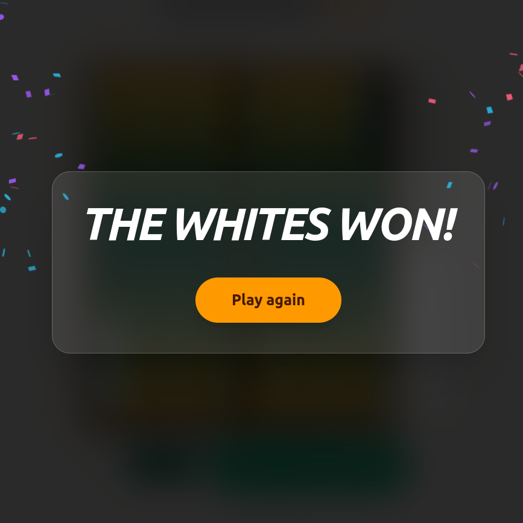

# 🎲 Backgammon Long

A modern web implementation of the classic **"Long Backgammon"** board game, built with the cutting-edge **Ruby on Rails 8** stack. This project combines traditional rules with the high interactivity of a modern single-page application.





## 🚀 Key Features

-   **Complete Ruleset**: Implemented full game logic including counter-clockwise movement, the "Head" rule (one checker per turn), "Block" rule (no 6-checker barriers unless the opponent has passed), and bearing off logic.
-   **SPA Experience with Hotwire**: Utilizing **Turbo Streams** and **Stimulus JS** to provide a seamless experience without page reloads. Moves and dice rolls are updated instantly.
-   **Fully Responsive Design**: The game board automatically scales to fit any screen size (Desktop/Tablet/Mobile) while maintaining its aspect ratio, powered by **Tailwind CSS 4**.
-   **Victory Celebration**: Interactive fireworks animation using the `canvas-confetti` library when a player wins.
-   **Server-Side Integrity**: All game logic and move validations are performed on the backend, preventing cheating via browser console manipulation.

## 🛠 Tech Stack

-   **Backend**: Ruby 3.2+, Rails 8.1.1
-   **Database**: SQLite (storing board state as JSON)
-   **Frontend**: Hotwire (Turbo + Stimulus), Tailwind CSS 4
-   **Asset Pipeline**: Propshaft + Importmaps (Zero-Node.js build)
-   **Animations**: canvas-confetti (ESM)

## 📋 Implemented Game Rules

1.  **Initial Setup**: Classic Long Backgammon starting positions (15 checkers on the "Head").
2.  **Dice Logic**: Random generation with support for "Zari" (doubles), granting 4 moves instead of 2.
3.  **Head Rule**: Restriction on taking more than one checker from the head per turn (except for the very first double of the game).
4.  **Blocking (Prime)**: Prevention of building a 6-checker barrier if the opponent hasn't passed that section yet.
5.  **Smart Turn Switching**: Automatic turn transition if a player has no legal moves available.
6.  **Bearing Off**: Ability to remove checkers from the board only after all 15 checkers have entered the "Home" area.

## ⚙️ Installation & Setup

To run this project locally:

1. Clone the repository:
   ```bash
   git clone https://github.com/your-username/backgammon.git
   cd backgammon
   ```

2. Install dependencies:
   ```bash
   bundle install
   ```

3. Prepare the database:
   ```bash
   bin/rails db:prepare
   ```

4. Start the development server (includes Tailwind watcher):
   ```bash
   bin/dev
   ```

5. Open your browser at: `http://localhost:3000`

---
Built with ❤️ and respect