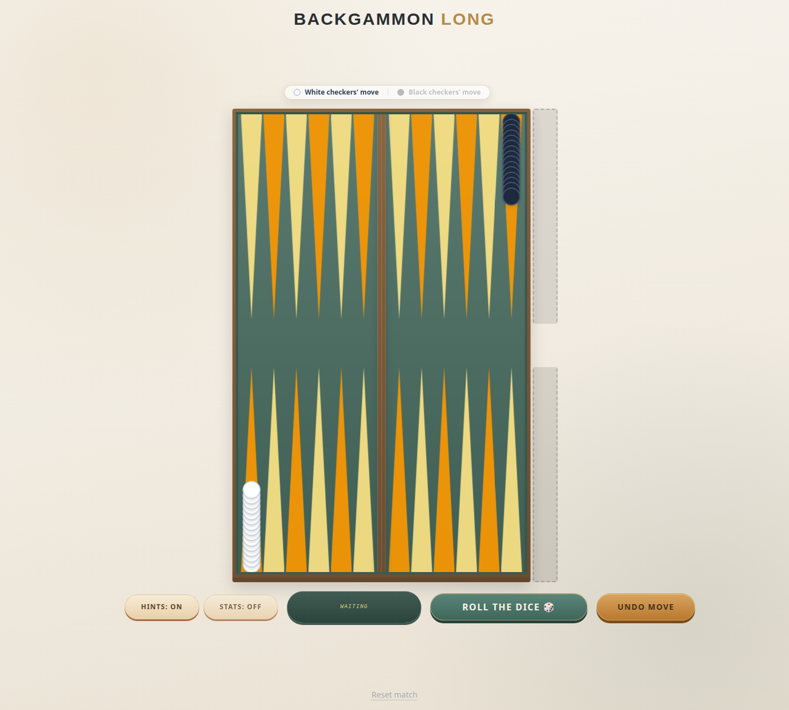
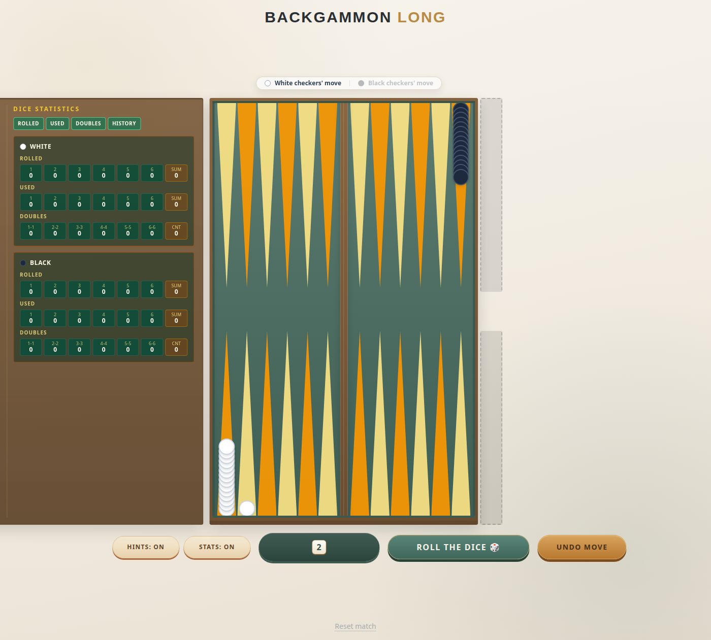

# Backgammon Long

Интерактивная веб-версия классических длинных нард на Ruby on Rails 8 с современным UI, быстрой реакцией интерфейса через Hotwire и строгой серверной валидацией правил.

[](https://github.com/RubyArtm/backgammon/actions/workflows/ci.yml)
[](https://www.ruby-lang.org/)
[](https://rubyonrails.org/)

## Ссылки

- Репозиторий: **https://github.com/RubyArtm/backgammon**
- Live demo: **https://art-backgammon.onrender.com/**

## Скриншоты


*Главный экран матча с доской, индикатором хода, кубиками и управлением.*


*Открытая боковая панель: статистика бросков и история ходов (replay-ready интерфейс).*


*Актуальный экран победы с анимированным оверлеем и кнопкой быстрого рестарта.*

## Что умеет приложение

- Полная игровая логика длинных нард с серверной проверкой каждого хода.
- Корректная обработка дублей (4 хода вместо 2).
- Правило головы: одна шашка за ход (с исключением первого подходящего дубля).
- Проверка блока из 6 подряд и запрет нелегального блока.
- Снятие шашек только после полного входа в дом.
- Автопас хода при отсутствии легальных ходов.
- `Undo` до броска кубиков соперника.
- История ходов и режим replay (пошаговый просмотр партии).
- Статистика кубиков по игрокам: выпало/использовано/дубли.
- Отзывчивый интерфейс и обновления без перезагрузки страницы (Turbo Streams).

## Правила партии в реализации

1. Стартовая расстановка: по 15 шашек на голове у каждого игрока.
2. Ход белых и черных идет по заранее заданным путям на 24 пункта.
3. Перемещение возможно только на значения активных кубиков.
4. Нельзя занимать пункт с шашками соперника.
5. При дубле игрок получает 4 доступных перемещения.
6. После исчерпания всех значений кубиков ход автоматически переходит сопернику.
7. Победа фиксируется при выбросе всех 15 шашек.

## Стек и архитектура

- Backend: Ruby `3.3`, Rails `8.1.1`
- Frontend: Hotwire (`turbo-rails`, `stimulus-rails`)
- UI: Tailwind CSS 4 (`tailwindcss-rails`)
- Asset pipeline: Propshaft + Importmap
- Хранилище состояния партии: JSON-поля в таблице `games`
- БД (development/test): SQLite
- БД (production): PostgreSQL (primary/cable/queue/cache)

Ключевые компоненты:

- `Game` + `Backgammon::GameState` для состояния и сценариев партии
- `Backgammon::Rules` для валидации правил и легальности ходов
- `GamesController` для действий `roll_dice`, `move`, `undo_move`, `reset`
- `Stimulus game_controller` для клиентского UX, подсветки и управления UI-предпочтениями

## Быстрый старт

### Требования

- Ruby `3.3`
- Bundler
- SQLite3 (для локального запуска)

### Установка

```bash
git clone https://github.com/RubyArtm/backgammon.git
cd backgammon
bundle install
bin/rails db:prepare
```

### Запуск в development

```bash
bin/dev
```

После запуска приложение доступно по адресу `http://localhost:3000`.

## Тесты и качество

Запуск тестов:

```bash
bin/rails test
```

Полный CI-профиль локально:

```bash
bin/brakeman --no-pager
bin/bundler-audit
bin/importmap audit
bin/rubocop -f github
bin/rails db:test:prepare test test:system
```

## Основные HTTP endpoints

- `GET /` - игровое поле
- `POST /games/:id/roll_dice` - бросок кубиков
- `POST /games/:id/move` - ход шашкой
- `POST /games/:id/undo_move` - откат последнего хода
- `POST /games/:id/reset` - новая партия (`preserve_stats=true` для сохранения статистики)
- `GET /up` - Rails health check

## Деплой

В проекте предусмотрены:

- `Dockerfile` для контейнеризации
- конфигурация Kamal (`config/deploy.yml`)

Для продакшена используются PostgreSQL и Solid Queue/Cache/Cable.
